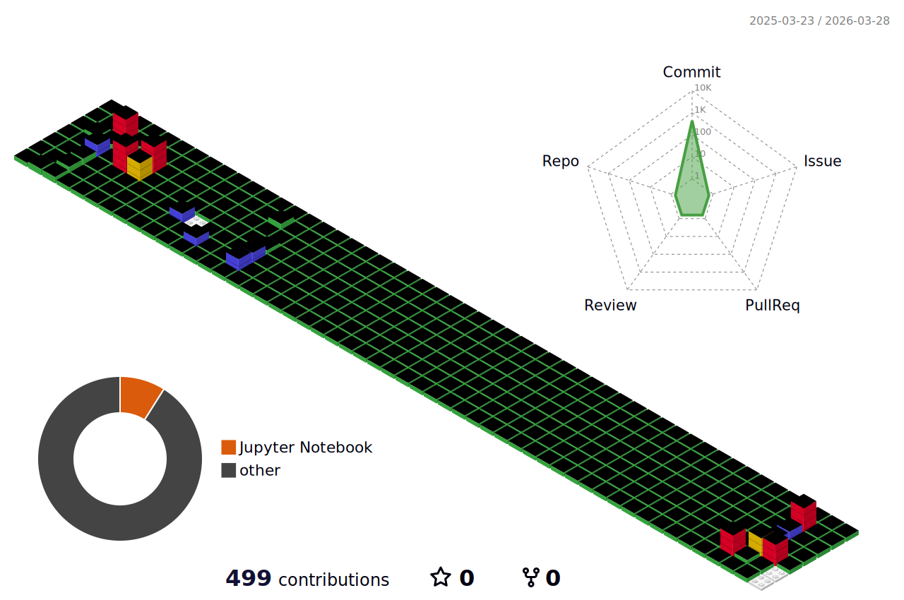

# Hello World!🌎

## 🚀 About Me
#### Hello🖐️ I am Sungsoo Kwon, an AI Engineer 🖥️

<h2>📚skills📚</h2>

  </a>&nbsp
  </a>&nbsp
  </a>&nbsp
  </a>&nbsp
  </a>&nbsp
  

  <h3>☑️Career☑️</h3>
  

  | Type    |Date | Description                                    |  Organization                         |
  | ---------- |---------- | ---------------------------------------------- | ---------------------------------------------- |
  | Education |2017.03. | Enrolled in Department Big Data Engineering         | Daegu Catholic University |
  | Education |2021.12. ~ 2023.02. | Undergraduate Researcher at DCU-KTAI Lab  | Daegu Catholic University |
  | Internship |2022.01. ~ 2022.03. | Winter Research Internship | Electronics and Telecommunications Research Institute (ETRI) |
  | Internship |2023.01. ~ 2023.03. | Winter Research Internship | Electronics and Telecommunications Research Institute (ETRI) |
  | Education |2023.02. | Graduated with a Bachelor's Degree | Daegu Catholic University |
  | Education |2025.02. | Graduated with a Master's Degree | Daegu Catholic University |

<h3>☑️Career☑️</h3>

<table>
  <tr>
    <th>Type</th>
    <th>Date</th>
    <th>Contents</th>
    <th>Organization</th>
  </tr>
  <tr>
    <td><strong>Education</strong></td>
    <td><strong>2017. 3</strong></td>
    <td><strong>Enrolled in Big Data Engineering Department</strong></td>
    <td><strong>Daegu Catholic University</strong></td>
  </tr>
  <tr>
    <td><strong>Research Activities</strong></td>
    <td><strong>2021. 12~2023. 02</strong></td>
    <td><strong>Undergraduate Researcher at DCU-KTAI Lab</strong></td>
    <td><strong>Daegu Catholic University AI & Big Data Department</strong></td>
  </tr>
  <tr>
    <td><strong>Internships</strong></td>
    <td><strong>2022. 1 ~ 2022. 3</strong></td>
    <td><strong>Winter Research Internship</strong></td>
    <td><strong>Electronics and Telecommunications Research Institute (ETRI)</strong></td>
  </tr>
  <tr>
    <td><strong>Internships</strong></td>
    <td><strong>2023. 1 ~ 2023. 3</strong></td>
    <td><strong>Winter Research Internship</strong></td>
    <td><strong>Electronics and Telecommunications Research Institute (ETRI)</strong></td>
  </tr>
  <tr>
    <td><strong>Education</strong></td>
    <td><strong>2023. 2. 17</strong></td>
    <td><strong>Graduated with a Bachelor's Degree</strong></td>
    <td><strong>Daegu Catholic University</strong></td>
  </tr>
  <tr>
    <td><strong>Education</strong></td>
    <td><strong>2023. 3 ~ 2025. 2</strong></td>
    <td><strong>Graduated with a Master's Degree</strong></td>
    <td><strong>Daegu Catholic University, Master's degree, Knowledge Transfer AI Lab</strong></td>
  </tr>
</table>

<h3 align="center"> 📫 Contact 📫 </h3>

  

---
# 

  

