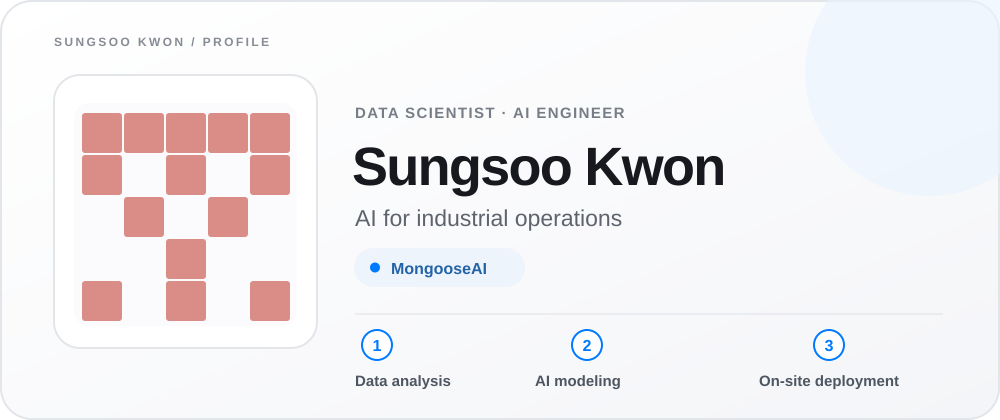
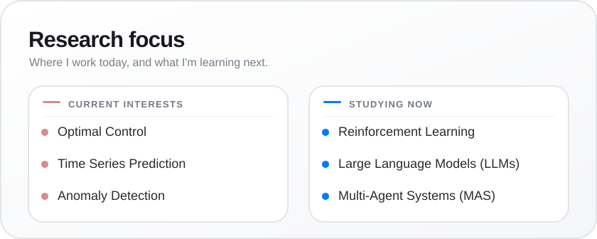

  

   

  <!-- Typing animation: https://github.com/DenverCoder1/readme-typing-svg -->
  

   

  
  
  

### About Me

I'm **Sungsoo Kwon**, a Data Scientist and AI Engineer at **MongooseAI**. I develop AI solutions for industrial operations, covering the full process from data analysis and model development to deployment on site.

### Skills

### Research Interests

  

### Experience

| Period | Experience |
| :-- | :-- |
| 2025.05 – Present | Data Scientist & AI Engineer · MongooseAI |
| 2023.03 – 2025.02 | Master's degree · Daegu Catholic University |
| 2023.01 – 2023.03 | Research Intern · ETRI |
| 2022.01 – 2022.03 | Research Intern · ETRI |
| 2021.12 – 2023.02 | Undergraduate Researcher · DCU-KTAI Lab |
| 2017.03 – 2023.02 | Bachelor's degree · Daegu Catholic University |
