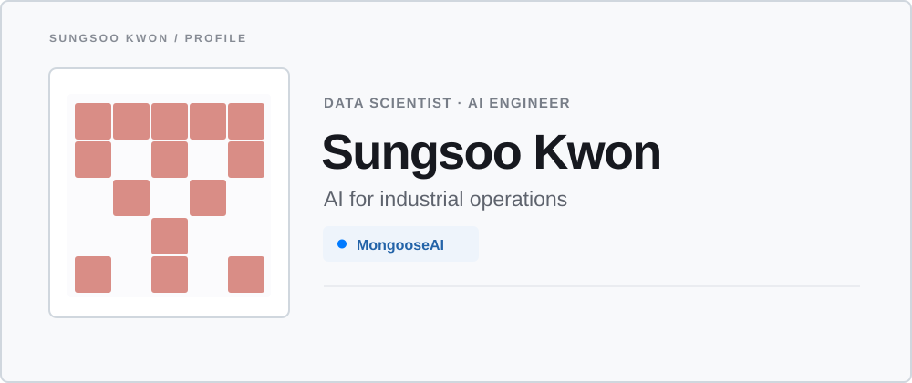
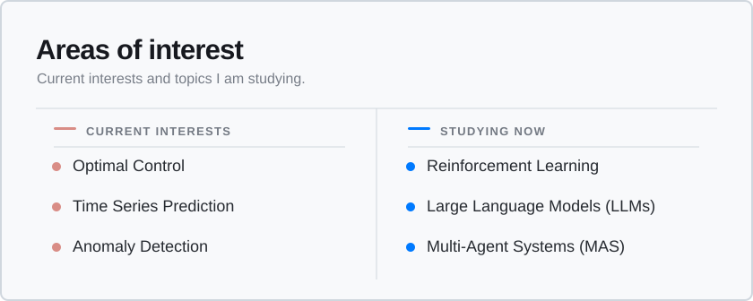

  

   

  
  
  

### About Me

  

> Hello! I'm **Sungsoo Kwon**, a Data Scientist and AI Engineer at **MongooseAI**. I develop AI solutions for industrial operations, from data analysis and model development to validating performance on site and adapting models to real operating conditions.

> 안녕하세요! 저는 **MongooseAI**에서 데이터 사이언티스트이자 AI 엔지니어로 일하고 있는 **권성수**입니다. 산업 현장에 AI를 적용하며, 데이터 분석과 AI 모델 개발부터 현장에서 모델의 작동을 검증하고 운영 환경에 맞게 수정하는 과정까지 담당하고 있습니다.

### Areas of Interest

  

### Skills

 Python &nbsp;&nbsp;  PyTorch &nbsp;&nbsp;  TensorFlow

### Experience

| Period | Experience |
| :-- | :-- |
| 2025.05 – Present | Data Scientist & AI Engineer · MongooseAI |
| 2023.03 – 2025.02 | Master's degree · Daegu Catholic University |
| 2023.01 – 2023.03 | Research Intern · ETRI |
| 2022.01 – 2022.03 | Research Intern · ETRI |
| 2021.12 – 2023.02 | Undergraduate Researcher · DCU-KTAI Lab |
| 2017.03 – 2023.02 | Bachelor's degree · Daegu Catholic University |

### Contribution Snake

  

