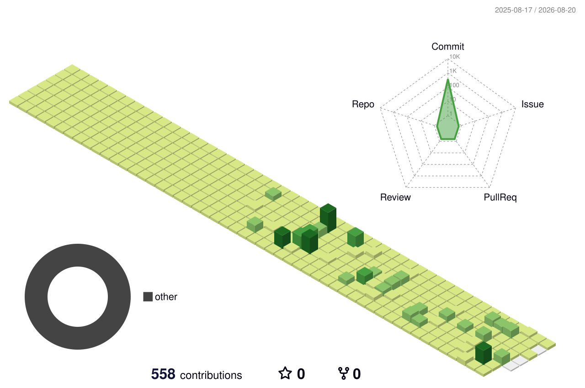

  

   

  <a href="mailto:thesng.k@gmail.com">Email</a> ·
  <a href="https://github.com/SungsooKwon">GitHub</a>

### About Me

I'm **Sungsoo Kwon**, a Data Scientist at **MongooseAI**.

### Skills

### Experience

| Period | Experience |
| :-- | :-- |
| 2025.05 – Present | Data Scientist · MongooseAI |
| 2023.03 – 2025.02 | Master's degree · Daegu Catholic University |
| 2023.01 – 2023.03 | Research Intern · ETRI |
| 2022.01 – 2022.03 | Research Intern · ETRI |
| 2021.12 – 2023.02 | Undergraduate Researcher · DCU-KTAI Lab |
| 2017.03 – 2023.02 | Bachelor's degree · Daegu Catholic University |

### GitHub Contributions

  <picture>
    <source media="(prefers-color-scheme: dark)" srcset="./profile-3d-contrib/profile-night-green.svg" />
    <source media="(prefers-color-scheme: light)" srcset="./profile-3d-contrib/profile-green-animate.svg" />
    
  </picture>

