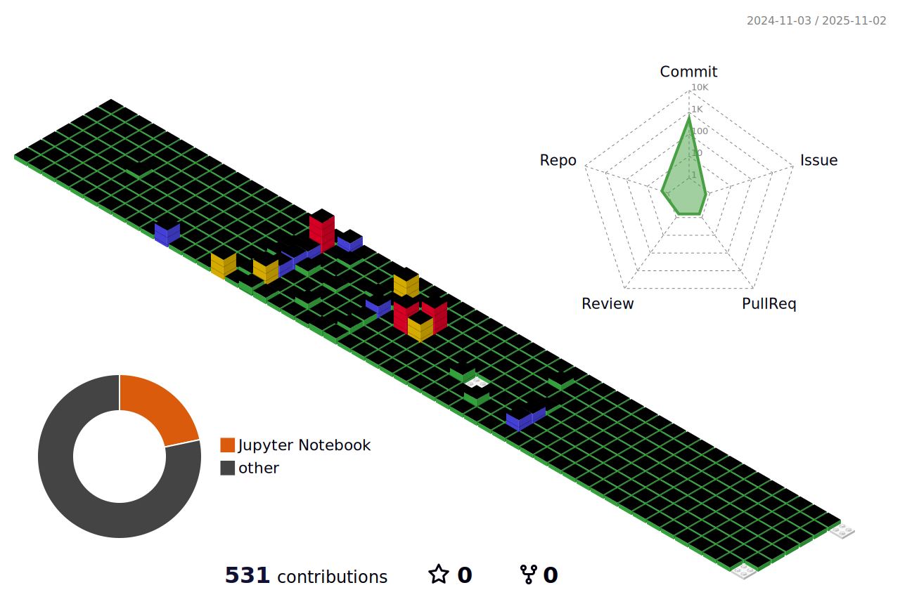

<h2>📚skills📚</h2>

  </a>&nbsp
  </a>&nbsp
  </a>&nbsp

<h3>☑️Career☑️</h3>

<table>
  <tr>
    <th>Type</th>
    <th>Date</th>
    <th>Contents</th>
    <th>Organization</th>
  </tr>
  <tr>
    <td><strong>Education</strong></td>
    <td>2017. 3</td>
    <td>Enrolled in Big Data Engineering Department</td>
    <td><strong>Daegu Catholic University</strong></td>
  </tr>
  <tr>
    <td><strong>Internships</strong></td>
    <td>2021. 11 ~ 2021. 12</td>
    <td>Global SW Internship</td>
    <td><strong>Globallear</strong></td>
  </tr>
  <tr>
    <td><strong>Research Activities</strong></td>
    <td>2021. 12 ~ 2023. 02</td>
    <td>Undergraduate Researcher at DCU-KTAI Lab</td>
    <td><strong>Daegu Catholic University AI & Big Data Department</strong></td>
  </tr>
  <tr>
    <td><strong>Internships</strong></td>
    <td>2022. 1 ~ 2022. 3</td>
    <td>Winter Research Internship</td>
    <td><strong>Electronics and Telecommunications Research Institute (ETRI)</strong></td>
  </tr>
  <tr>
    <td><strong>Internships</strong></td>
    <td>2023. 1 ~ 2023. 3</td>
    <td>Winter Research Internship</td>
    <td><strong>Electronics and Telecommunications Research Institute (ETRI)</strong></td>
  </tr>
  <tr>
    <td><strong>Education</strong></td>
    <td>2023. 2. 17</td>
    <td>Graduated with a Bachelor's Degree</td>
    <td><strong>Daegu Catholic University</strong></td>
  </tr>
  <tr>
    <td><strong>Education</strong></td>
    <td>2023. 3 ~ 2025. 2</td>
    <td>Graduate Program in AI and Big Data</td>
    <td><strong>Daegu Catholic University, Knowledge Transfer AI Lab</strong></td>
  </tr>
</table>

<h3 align="center"> 📫 Contact 📫 </h3>

  

---

